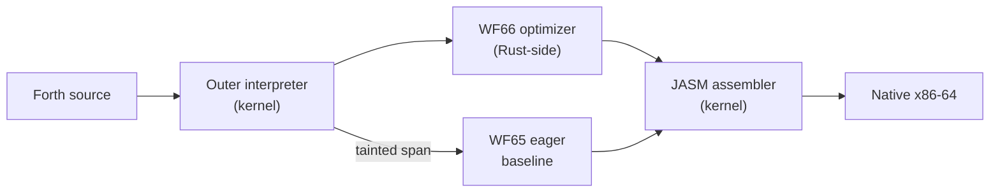

# WF66

WF66 is a **token-IR optimizing Forth compiler** for Windows x86-64. It is the
successor to WF65 (a complete 64-bit STC Forth) and reuses WF65's proven
runtime — JASM/Rasm native encoding, the STC kernel primitives, the dictionary,
the live REPL, and the Rust test harness — while replacing the compiler.

The binary is a Direct2D MDI GUI with an interactive REPL, a live stack viewer,
a diagnostic log pane, and a crash-dump viewer.

## Architecture



- **Direct-call threading (STC).** Every word is a native machine-code
  procedure. Calling one word from another is a plain `call rel32` — no inner
  interpreter, no dispatch table.
- **Token-IR compiler.** Each `:`…`;` body is captured as a token stream,
  optimized as data (two-level pattern-rewriting), and only then assembled.
  The eager WF65 path remains as a fallback for spans the optimizer cannot
  fully defer.
- **JASM kernel.** Primitives are written in MASM-flavoured assembly using the
  JASM macro assembler, expanded at process start. No separate assembler
  invocation; no link step.
- **ANS Forth surface.** CORE, CORE-EXT, FILE, and MEMORY wordsets largely
  covered. Float math (`fsin`, `fcos`, `fsqrt`, `f.`, …) implemented.
  `lib/core.f` provides the higher-level vocabulary at startup.
- **Single-inheritance OOP.** Class/object system with late and early binding,
  `super`, scoped ivars, value-form ivar reads, and PIC dispatch — all built
  in Forth except the two-instruction send hot path.
- **Paged GC and managed strings.** A page-heap garbage collector (shared with
  the NewGC portfolio) manages the dynamic heap. The managed-string library is
  built on top.
- **Crash recovery.** A vectored exception handler captures a register snapshot
  and stack listing after any SEH fault and presents it in the crash-dump pane.
  The IDE stays up; close the dump and restart to continue.

## Feature highlights

- Interactive REPL with input history, transcript scrollback, and clipboard
- Live stack viewer updated after every eval (View → Stack, `Ctrl+Shift+K`)
- Log view for diagnostic output (View → Log, `Ctrl+Shift+L`)
- Crash-dump pane showing registers + stack words (`Ctrl+Shift+X`)
- Editor pane (`fedit`) with F5 to run buffer, undo/redo, word navigation
- Demos menu auto-populated from `.f` files in `demos/`
- `CODE` escape hatch — define new primitives inline with JASM assembly
- `LET` infix expression evaluator for compact floating-point work
- `forget_last` to roll back the most recent definition during development
- WF66 Optimizer toggle (Forth → WF66 Optimizer; on by default)
- Cooperative multitasking — every graphical pane is an *agent* (green thread), so
  the console stays live while windows render ([Multitasking in Forth](multitasking-in-forth.md))

## Pages

### Getting around

| Page | What |
|---|---|
| [Getting Started](getting-started.md) | Running WF66, first REPL session, basic workflow |
| [IDE Guide](ide-guide.md) | REPL, console, stack view, log, crash dump, editor, menus |
| [Keyboard Shortcuts](keyboard-shortcuts.md) | Complete shortcut table for all panes |

### Learning Forth

| Page | What |
|---|---|
| [Forth Tutorial](forth-tutorial.md) | Stack model, words, control flow — from scratch |
| [Forth Reference](forth-reference.md) | Core word reference with stack effects |
| [ANS Gap Analysis](ANS_GAP_ANALYSIS.md) | ANS Forth-2012 compliance status |

### Compiler and runtime

| Page | What |
|---|---|
| [Optimizer](optimizer.md) | Token-IR optimizer — pipeline, passes, benchmarks, scope |
| [Object System](objects.md) | Classes, methods, instance variables, polymorphism, PIC dispatch |
| [Multitasking in Forth](multitasking-in-forth.md) | Cooperative agents — green-thread pane-agents, `pause`/`receive`/`(post)`, building responsive windowed apps |
| [LET Expressions](dsl_user_guide.md) | Infix math evaluator for compact FP work |
| [Managed Strings](strings_design.md) | V2s managed strings — GC-backed, length-prefix |
| [Vocabularies](vocabularies.md) | Wordlists, search order, `also`/`previous`, scoping |
| [Memory Map](memory-map.md) | Process address layout — dictionary, stacks, user area |
| [Tracing](tracing_forth.md) | Debug tracing, word stepping, diagnostic tools |

### Internals

| Page | What |
|---|---|
| [GC Design](gc_design.md) | Page-heap mark-evacuate collector design |
| [Dictionary Header](dict_header.md) | `dh_*` header layout, type-flag table |
| [Dictionary Overlay](dictionary_overlay.md) | How WF66 layers its dictionary on top of the kernel |

## Quick start

Double-click **`wf64-ui.exe`**. Type at the `>` prompt and press Enter:

```forth
2 3 + .
```

Should print `5 ok`. The [Getting Started](getting-started.md) guide walks
through the first session from there.

The optimizer runs automatically. To see before/after assembly for a word:

```
cargo run --bin opt-bench --features opt-metrics -- wf66_mandel_inner
```
