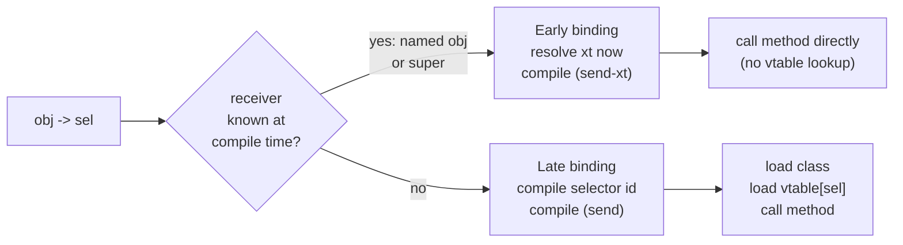
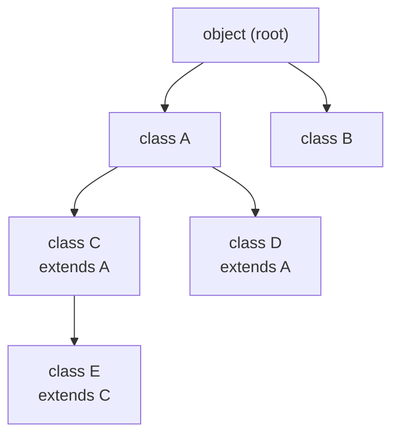

# Object System

WF66 has a single-inheritance class-and-object system built almost entirely in
Forth. The dispatch hot path is a handful of MASM instructions; everything else
— class definition, method bodies, `ivar:`, `->`, `super` — is ordinary Forth
compiled by the same kernel. All 350 OOP tests pass.

---

## Quick example

```forth
object subclass counter
  cell ivar: count

  :m reset ( -- )   0 to count ;m
  :m tick  ( -- )   count 1+ to count ;m
  :m value ( -- n ) count ;m
end-class

counter new c
c -> reset
c -> tick   c -> tick   c -> tick
c -> value .        \ prints 3
```

The receiver (`c`) sits on the stack **before** the send (`-> value`). Args, if
any, sit below the receiver. Inside a method, `self` is the receiver — it is
not on the data stack, having been moved there by the send primitive.

---

## Defining a class

```forth
object subclass <name>      \ inherit from the root class
<parent> subclass <name>    \ inherit from any existing class
```

`class <name>` is shorthand for `object subclass <name>`.

Inside the class body, between the opening `subclass`/`class` and the closing
`end-class`, you may declare instance variables and define methods:

```forth
  <size> ivar: <fieldname>    \ add an instance variable of <size> bytes
  cell   ivar: <fieldname>    \ usual case — one pointer-sized cell

  :m <selector> ( stack-effect )
    ... body ...
  ;m
```

`end-class` closes the definition. You cannot add methods or ivars to a class
after `end-class`.

---

## Instance variables

`ivar:` declares a per-instance field. Inside any method on that class (or a
subclass), the bare field name:

- **Reads the value**: `count` fetches the current integer from the field.
- **Writes with `to`**: `42 to count` stores 42 into the field.
- **Gets the address** (for `+!`, `cmove`, by-ref): `addr-of count`

```forth
object subclass point
  cell ivar: x
  cell ivar: y

  :m set ( nx ny -- )  to y  to x ;m
  :m show ( -- )       ." (" x . ." , " y . ." )" cr ;m
  :m move ( dx dy -- ) y + to y   x + to x ;m
end-class
```

ivar names are **scoped to their class** — `x` and `y` are invisible outside
the class body. Different classes may reuse the same ivar names with no
collision.

The value-read form compiles to roughly 4 instructions (two dependent loads off
`self`). There is no function call. `addr-of x` and the older `legacy-ivar:`
form return the address if you need it.

Inherited ivars work unchanged. A subclass's first ivar follows the last ivar
of its parent at the next aligned offset.

---

## Creating objects

```forth
<class> new <name>
```

`new` allocates the object in the dictionary, zeroes all ivar cells, and
defines `<name>` as a word that pushes the object's base address. Named objects
are statically allocated — they live for the session.

```forth
point new origin
point new cursor
3 4 cursor -> set
cursor -> show
```

---

## Sending messages (`->`)

`->` is an immediate word that **parses the selector name** to the right:

```forth
obj -> selector
args obj -> selector
```

- In the **REPL / interpret state**: executes the send immediately (always
  late-bound).
- In **compiled code**: chooses early or late binding at compile time — see
  §[Binding](#binding-early-vs-late) below.

Multiple sends chain naturally because the receiver is just a stack value:

```forth
: show-all ( -- )
  origin -> show
  cursor -> show ;
```

A receiver can come from anywhere — a named object, a variable, a word that
returns one. Only the form `<receiver-expr> -> <selector>` matters.

---

## Polymorphism

Any number of classes may implement the same selector. A send resolves at
runtime to the method in the **actual class of the receiver**:

```forth
object subclass shape
  :m draw ( -- )  ." (abstract shape)" cr ;m
end-class

shape subclass circle
  cell ivar: radius
  :m draw ( -- )  ." circle r=" radius . cr ;m
end-class

shape subclass rect
  cell ivar: w   cell ivar: h
  :m draw ( -- )  ." rect " w . ." x " h . cr ;m
end-class

circle new c1   rect new r1
10 to c1 radius   3 to r1 w   4 to r1 h

: redraw ( shape -- )  -> draw ;   \ late-bound; works for any shape

c1 redraw       \ prints: circle r=10
r1 redraw       \ prints: rect 3 x 4
```

---

## `super`

Inside a method, `super -> sel` calls the **parent class's version** of `sel`,
keeping `self` unchanged:

```forth
object subclass animal
  cell ivar: legs
  :m legs!    ( n -- )   to legs ;m
  :m speak    ( -- )     ." ..." cr ;m
  :m describe ( -- )     ." animal with " legs . ." legs: " self -> speak ;m
end-class

animal subclass dog
  :m speak    ( -- )     ." woof" cr ;m
  :m describe ( -- )     ." (dog) " super -> describe ;m
end-class

dog new rex
4 rex -> legs!
rex -> describe
```

Output: `(dog) animal with 4 legs: woof`

Walk-through:
1. `rex -> describe` — late-binds to `dog`'s `describe`.
2. `super -> describe` — early-binds to `animal`'s `describe` (no infinite loop).
3. Inside `animal`'s `describe`, `self -> speak` — `self` is still `rex`, so
   this late-binds to `dog`'s `speak`. Classic virtual dispatch through `super`.

---

## Binding: early vs late



**Late binding** (the default) performs a vtable lookup at runtime — one load
of the class pointer, one indexed load into the vtable. Any receiver can use it.

**Early binding** fires when the compiler knows the receiver's class at compile
time — specifically when the word compiled just before `->` was a named object
(created with `new`) or `super`. The send compiles as a direct call to the
method's xt with no vtable touch. Both bindings are **semantically identical**;
early binding is a compile-time speed optimisation that makes no difference to
program behaviour.

You never have to choose: the compiler decides automatically from context.

---

## PIC dispatch (polymorphic inline cache)

A late-bound `obj -> sel` that appears in compiled code compiles to a **fast
inline-cache path** rather than the plain `literal sel; call (send)` sequence.

Each send site has a 32-byte cache record `{cached_class, cached_xt, sel_id,
epoch}` in the no-execute VAR region. The compiled code checks:

1. Load the receiver's class.
2. If class == `cached_class` **and** the OOP epoch is current — hit: jump
   directly to the cached method xt, skipping the vtable lookup entirely.
3. Otherwise — miss: look up in the vtable, fill the cache, jump to the method.

The cache is **invalidated** by method redefinition: `vt!` (the only vtable
writer) bumps a global epoch counter, so any redefinition invalidates every
cache site at once. `reset()` is automatically safe because each site allocates
its own record at compile time.

The PIC means that a call site that sees the same class repeatedly pays only
one pointer comparison and one load after the first call. It is most visible
on tight loops that send the same message to the same object every iteration.

---

## Data structures (reference)

### Class struct

A class is a `create`'d word whose body is the class struct:

```
offset  field        meaning
  +0    class_super  parent class struct ptr (0 for root `object`)
  +8    class_isize  total instance size in bytes (includes +0 header cell)
 +16    class_vt     vtable — 256 cells, vtable[sel_id] = method xt
```

Total class struct size: 16 + 256×8 = **2 KB**. The vtable is initialized by
copying the parent's vtable (so every inherited method is already present),
then each `:m` writes its slot. The root `object` vtable fills every slot with
`(dnu)` — "does not understand", which throws exception −2058.

### Object layout

```
offset  meaning
  +0    class pointer → class struct
  +8    first ivar
 +16    second ivar
  ...
```

`self` is the base address (the address of the class-pointer cell). An ivar at
byte-offset `k` sits at `self + k`.

### Selectors

Each distinct method name is assigned a **selector id** (a small integer, 0
through 255). Selector ids live in a flat name→id table allocated below the
boot fence so they survive `reset()`. The cap is 256 distinct selectors per
session. Selector names are entirely separate from the main dictionary — `:m .`
is a perfectly legal method name and never shadows the number-printing `.`.

---

## Inheritance diagram



`subclass` copies the entire parent vtable into the child, then each `:m` body
overwrites its slot. Inherited methods cost nothing at send time — they are
already in the child's vtable. There is no parent-chain walk.

---

## Worked example: shapes

```forth
\ Base class with shared ivars and abstract methods
object subclass shape
  cell ivar: cx   cell ivar: cy
  :m at ( x y -- )    to cy  to cx ;m
  :m x  ( -- n )      cx ;m
  :m y  ( -- n )      cy ;m
  :m area ( -- n )    0 ;m          \ override in subclasses
  :m draw ( -- )      ." (shape)" cr ;m
end-class

shape subclass circle
  cell ivar: r
  :m radius! ( n -- )  to r ;m
  :m area    ( -- n )  r r * 314 100 */ ;m  \ π r² ≈ 3.14 r²
  :m draw    ( -- )
    ." circle r=" r . ." at (" cx . ." ," cy . ." ) area=" self -> area . cr ;m
end-class

shape subclass rect
  cell ivar: w   cell ivar: h
  :m size  ( w h -- )  to h  to w ;m
  :m area  ( -- n )    w h * ;m
  :m draw  ( -- )
    ." rect " w . ." x" h . ." at (" cx . ." ," cy . ." ) area=" self -> area . cr ;m
end-class

\ Polymorphic draw via late binding
: draw-shape ( shape -- )  -> draw ;

circle new c1   3 4 c1 -> at   10 c1 -> radius!
rect   new r1   1 2 r1 -> at   5 3 r1 -> size

c1 draw-shape
r1 draw-shape
c1 -> area .     \ prints 314
r1 -> area .     \ prints 15
```

---

## Edge cases and gotchas

**Unknown message** — if `-> sel` sends a message the class does not implement
(and no ancestor implements it either), the vtable slot holds `(dnu)`, which
throws exception `−2058` with the selector name.

**`EXIT` inside a method** — safe. The `self` save/restore bracket is installed
by the *send*, not the method body. An `EXIT` inside a method returns into the
restore thunk, which pops the old `self` and then returns to the caller.

**`>r`/`r>` inside a method** — safe, subject to normal Forth return-stack
discipline. The send thunk pushes two cells on the return stack (old self +
restore address); a method that uses `>r`/`r>` must keep them balanced as it
always would.

**Methods added after a subclass** — not supported. Classes are closed at
`end-class`. A subclass that already exists has already copied the vtable; any
new `:m` on the parent will not be visible in the child. Define all methods
before creating subclasses.

**Selector cap** — the system supports 256 distinct selector names per session.
Exceeding this throws at `:m` time. The constant `oop-max-selectors` can be
bumped (requires a rebuild).

**`>body` on a class or object word** — returns the struct/object base, so
existing tools (`see`, the decompiler) keep working. The `dh_tfa` tag is `tfa_tcre`
(created word) for both; class words additionally record their role in the
dictionary type flags.

---

[WF66 home](index.md) · [Getting Started](getting-started.md) · [Optimizer](optimizer.md)
