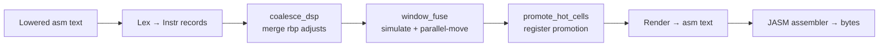
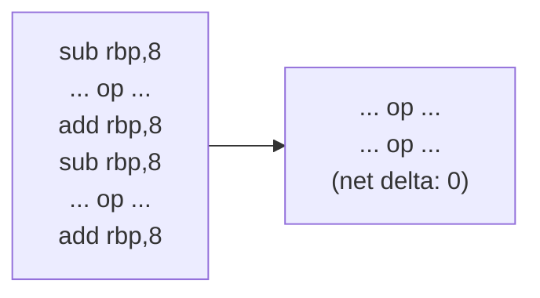
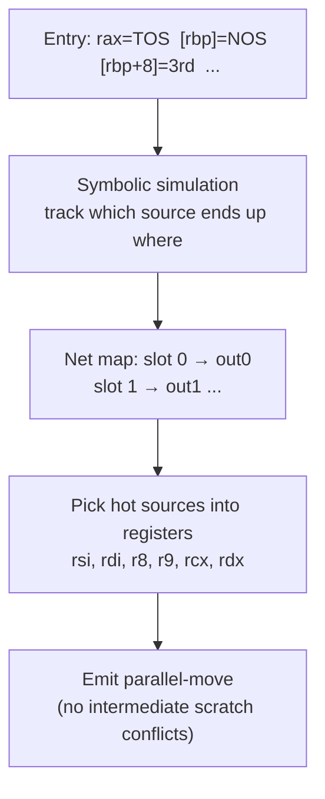
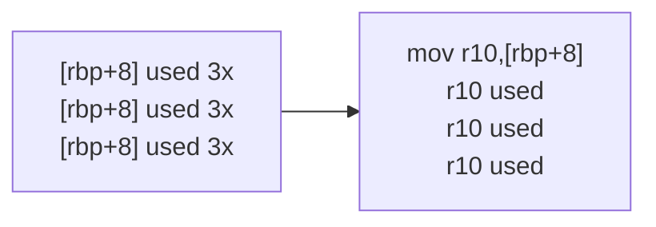

# WF66 Optimizer

WF66 is a **token-IR optimizing compiler** layered on top of the proven WF65
subroutine-threaded kernel. The key difference: WF65 emits machine code eagerly
as it reads each word of a definition, then rewinds and replays to patch it.
WF66 **captures the definition as a token IR first, optimizes the tokens as
data, and generates code only when the definition is complete**.

The optimizer runs Rust-side. Forth remains the surface language — outer
interpreter, immediate words, `CREATE`/`DOES>`, the OOP system. The optimizer
is invisible from Forth; the only observable effect is that generated code is
smaller and faster.

---

## The two-level pipeline

WF66 applies one idea at two levels: *recognize a pattern, replace it with a
cheaper equivalent, repeat until nothing changes*. No SSA form, no register
allocator, no CFG — both stages are pattern-driven rewriters.

```mermaid
flowchart LR
    SRC["Forth source"] --> CAP["Capture\nIrBuilder"]
    CAP --> TIR["Token IR\nvec of tokens"]
    TIR --> RED["Token-level\nreduce (fixpoint)"]
    RED --> LOW["Lower\ntoken → asm text"]
    LOW --> PARSE["Parse\ninstruction records"]
    PARSE --> COL["coalesce_dsp\nrbp-adjust deferral"]
    COL --> FUS["window_fuse\nauto-pick / parallel-move"]
    FUS --> PRO["promote_hot_cells\nread-only register promotion"]
    PRO --> REN["Render\nasm text"]
    REN --> ASM["Assemble\nnative x86-64 bytes"]
```



If any token in the captured stream is a **taint** (a word the optimizer cannot
reason about — see §[Deferred words](#deferred-words)), the definition falls
back to the eager WF65 baseline. Every other definition goes through all five
passes above.

---

## Level 1 — Token IR and token-level reduction

### What is the Token IR?

When a `:…;` definition is compiled, the WF66 recorder intercepts each
compiled token and accumulates it into a `Vec<Token>`. The main token kinds:

| Token | What it represents |
|---|---|
| `Lit(n)` | Integer literal push |
| `Inline(op)` | Binary arith op: `+`, `-`, `*`, `and`, `or`, `xor` |
| `ImmOp{op, k}` | Binary op with a constant immediate (`+ 7`, `* 4`) |
| `DupOp(op)` | Dup followed by op (`dup *`, `dup +`) |
| `Stack(op)` | Stack shuffle: `dup`, `drop`, `swap`, `over`, `rot`, `pick` |
| `Mem(op)` | Memory access: `@`, `!`, `c@`, `c!`, `2@`, `2!` |
| `Cmp(op)` | Comparison: `0<`, `0=`, `<`, `>`, `=`, `<>` |
| `CmpCtl(cmp,ctl)` | Fused comparison + branch (`0< if`, `= until`) |
| `Ctl(ctl)` | Control flow: `if`/`else`/`then`, `begin`/`until`/`while`/`repeat` |
| `Pick(n)` | Constant-index copy of the n-th stack cell |
| `FpBin(op)` | FP arithmetic: `f+`, `f-`, `f*`, `f/` |
| `FpMem(op)` | FP memory: `f@`, `f!` |
| `FpLit(bits)` | FP literal (64-bit bit pattern) |
| `FpFetchAbs(addr)` | Fused `fvariable f@` (direct absolute load) |
| `FpStoreAbs(addr)` | Fused `fvariable f!` (direct absolute store) |
| `OpenLocals(n)` | `{:` frame prologue — allocates n-slot locals frame |
| `CloseLocals(n)` | `;}` frame epilogue — balances an `OpenLocals` |
| `LocalFetch(off)` | Local variable read |
| `LocalStore(off)` | `to localname` store |
| `LocalFFetch(off)` | Float local read |
| `LocalFStore(off)` | `to floatlocal` store |
| `Call(xt)` | Settle-barrier call to a known word (libm, WF66 words) |
| `Word{xt}` | Call to a word the optimizer must treat as opaque |
| `Opaque` | Taint: fall back to WF65 for this definition |

### Token-level reduction rules

`reduce(tokens)` is a one-pass shift-reduce engine that runs to **fixpoint** —
it keeps scanning until no rule fires:

**Constant folding**

```
Lit(a)  Lit(b)  Inline(op)  →  Lit(a op b)
```

`7 3 *` (3 tokens) becomes `Lit(21)` (1 token). The operation is 64-bit
wrapping arithmetic (same semantics as the Forth words).

**Dead-code elimination**

```
Lit(n)  Stack(Drop)  →  (nothing)
Dup     Stack(Drop)  →  (nothing)
Over    Stack(Drop)  →  (nothing)
```

A pushed value never used is deleted entirely.

**Immediate-operand folding**

```
Lit(k)   Inline(op)  →  ImmOp{op, k}
```

`7 +` becomes a single `ImmOp{Add, 7}` — a register-immediate instruction
instead of a literal push followed by a register-register op.

**Immediate-immediate chaining**

```
ImmOp{op, k1}  ImmOp{op, k2}  →  ImmOp{op, k1 op k2}    (when fits i32)
```

`7 + 3 +` → `+10`. `1+ 1+ 1+ 1+` → `+4`.

**Dup-op fusion**

```
Stack(Dup)  Inline(op)  →  DupOp(op)
```

`dup *` becomes a single `DupOp(Mul)` — emitted as `imul rax,rax` (one
instruction, no stack traffic).

**Literal-zero comparison folding**

```
Lit(0)  Cmp(c)  →  Cmp(c.zero_form())
```

`0 =` (test against zero) becomes a unary zero-test — cheaper than loading 0
and comparing.

**Constant pick folding**

```
Lit(n)  Stack(Pick)  →  Pick(n)
```

Constant-indexed `pick` becomes a typed `Pick(n)` token that emits a direct
slot load.

**Compare→branch fusion**

```
Cmp(c)  Ctl(if)    →  CmpCtl(c, if)
Cmp(c)  Ctl(until) →  CmpCtl(c, until)
Cmp(c)  Ctl(while) →  CmpCtl(c, while)
```

`0< if` (comparison followed by branch) becomes a fused token that emits a
single conditional-jump instruction — no flag word is pushed and tested
separately.

The rule catalog is **ordered by miner frequency** (`cargo run --bin seq_freq`)
over a real Forth corpus, so the most common patterns reduce first.

---

## Level 2 — Lowering

After token-level reduction, each token is **lowered** to Intel-syntax assembly
text (targeting the WF66 settle-everywhere ABI):

| Register | Role |
|---|---|
| `rax` | TOS (top-of-stack) |
| `rbp` | DSP (data stack pointer, grows down by 8) |
| `rbx` | UP (user area pointer) |
| `xmm15` | FTOS (float top-of-stack) |
| `r10`, `r11` | Read-only promotion pool |
| `rsi`, `rdi`, `r8`, `r9`, `rcx`, `rdx` | Parallel-move temporaries |

Stacks are **canonical** (TOS in `rax`, rest in memory) at every call, control
edge, and `;`. This is the WF65 settle-everywhere ABI, inherited unchanged.
Control flow is emitted with rasm labels; the assembler resolves targets.

---

## Level 2 — Instruction-level passes

Rather than handing the lowered text directly to the assembler, WF66 **lexes it
into instruction records** and applies three more passes before re-rendering.
The passes key off **barrier-free windows** — runs of instructions between call
sites, control edges, and definition boundaries.



### Pass 1 — `coalesce_dsp`: rbp-adjust deferral



The data-stack pointer `rbp` is adjusted up and down for every push and pop.
Inside a barrier-free window, most of those adjusts cancel out. `coalesce_dsp`
defers all `add/sub rbp` instructions to the window edges, rewriting
intervening stack-slot displacements by the running delta, so paired adjusts
cancel and a shuffle run's N separate adjusts collapse to one net adjust at the
boundary.

**Example:** `dup dup +` involves 3 stack-pointer adjusts (−8, −8, +8) and 2
slot loads. After coalescing: net −8, 2 slot loads, no intermediate adjusts.

**Example:** `rot rot` (8 memory accesses in the eager baseline) collapses to 4
memory accesses for its net effect (`-rot`).

### Pass 2 — `window_fuse`: auto-pick and parallel-move

After coalescing, a barrier-free window is **pure fixed-offset slot addressing**
— every data-stack access is `[rbp + constant]`. `window_fuse` symbolically
simulates the window from the entry register-and-slot map to discover the **net
permutation/duplication** it computes, then emits the minimal parallel-move
sequence to realize that mapping:



Sources that are read twice or more are held in a register (avoiding redundant
memory reloads). Sources read once use a transient scratch register directly
(`memory → memory` via a scratch). The scratch pool has 6 registers; if a
window exceeds the pool it is split.

**Effect:** `swap drop swap drop` has a 4-instruction net map; the eager
sequence does 8 memory accesses; `window_fuse` emits 2.

### Pass 3 — `promote_hot_cells`: read-only register promotion

Any data-stack slot read **two or more times** in a window — and **never
written** — is loaded into a reserved register at the window's entry and reused
for every subsequent read. The promotion pool is `r10`, `r11` (disjoint from
the fusion scratch pool). Promotion stops when the pool is empty.



No liveness analysis, no spill code. A slot is promoted if and only if it has a
clear home (always at the same offset, never aliased within the window) and is
read repeatedly. The pool is small by design — two reserved registers are enough
for the patterns that appear in real Forth.

---

## Floating point

The FP stack mirrors the data stack: FTOS in `xmm15`, the rest in memory at
`user_FSP` in the user area. All float tokens lower as a verbatim mirror of the
kernel primitives. Additional optimizations:

- **`fvariable` reference** — a `fvariable` bare name is captured as a literal
  address, and `fvariable f@`/`f!` fuse to `FpFetchAbs`/`FpStoreAbs` — a
  single direct absolute load or store with no intermediate address on the stack.
- **`fp_coalesce`** — the FP stack pointer (`user_FSP`) is cached in a register
  across a run, instead of being reloaded from memory for every FP operation.
- **Libm words** (`fsqrt`, `fsin`, `fcos`, …) are reached via settle-barrier
  calls: stacks settle to canonical before the call, and optimization resumes
  on the other side. The optimizer's windows span around them.

---

## Locals (`{: … :}`)

A `{:`…`:}` definition is captured and WF66-compiled in full. Locals live in a
per-word frame at `R15`/LP (byte-offset slots from the frame base):

- `{:` records `OpenLocals(n)` into the IR (frame alloc + the stack-init
  stores). It must do this directly because `{:` is an immediate word that
  `postpone`s its own frame ops — they would otherwise appear past the recorder's
  capture point.
- `;` appends the paired `CloseLocals(n)`.
- Local fetches and `to`-stores are **inline-emitted** by the kernel and feed
  directly into the recorder as `LocalFetch`/`LocalStore`/`LocalFFetch`/`LocalFStore`.
- `to intlocal` emits a `mov [R15+off], rax`; `to floatlocal` emits a `movsd`.
- The body is a **balanced `[OpenLocals … CloseLocals]` unit**. A caller can
  inline it as a **nested frame** — `R15` dips into the callee's frame while
  the callee runs, then pops back — with no interference to the caller's own
  locals.

Float locals (`{: n | float zx :}`) are fully captured: float-local fetches,
`to`-stores, and float literals (`3e`) are all first-class tokens. A whole FP
loop in one word (`begin/until` + float locals) WF66-compiles end to end.

Locals are the natural **register-promotion target** in principle (word-private,
no aliasing). WF66 does *not* promote loop-carried locals across a back-edge
(the `begin` back-edge is a barrier, so promotion resets per iteration). That
gap is intentional — see §[Scope and stopping point](#scope-and-stopping-point).

---

## Deferred words

If a captured stream contains a **taint**, the entire definition falls back to
the eager WF65 baseline:

| Taint | Reason |
|---|---|
| `do` / `loop` | Loop-counter lives on the return stack in a non-standard layout |
| I/O words | Side effects with unknown stack depth |
| Return-stack words (`>r`, `r>`, `rdrop`) | Interfere with the return-address discipline |
| FP comparisons (`f<`, `f0<`, etc.) | FP flag register not modelled |
| Non-WF66 `Word{xt}` | Unknown stack effect |

`begin`/`until` and `begin`/`while`/`repeat` are **not** taints — they are
captured as `Ctl` tokens and lowered to conditional-branch pairs. Float locals
inside a `begin`/`until` loop work end to end.

---

## Settle-barrier calls

A call to a *known* word (any libm word, or any word that was itself
WF66-compiled) does not taint its caller. Instead:

1. Stacks settle to canonical (TOS→`rax`, rest in memory).
2. The call is emitted as `Call(xt)`.
3. Optimization resumes on the other side.

A WF66-optimized word is a leaf by construction, so calling it is always a
barrier-call (for large callees) or can be inlined (for small ones).

`variable`/`fvariable` names are captured as **literal addresses** — the
`create` stub bakes the body address as a `mov rax, imm64`, the recorder reads
it back and emits `Lit(addr)` or `FpFetchAbs(addr)`. No call, no taint.

---

## Scope and stopping point

WF66 optimizes **leaf words** and **inlined hot paths** — call-free regions
where owning registers is legal in the first place. Whole-program register
allocation across calls is not attempted because it is unachievable: calls
clobber caller-saved registers, and callee-saved registers impose save/restore
obligations that cost more than they save.

The one thing WF66 does not do is **promote loop-carried locals across the
`begin` back-edge** (keeping `zx`/`zy` in `xmm` registers across iterations
instead of in the `R15` frame). That is the only remaining gap to hand-MASM
performance on the Mandelbrot inner loop. It is a deliberate stopping point —
the current result is already well above the eager baseline, and the optimizer
is considered complete.

---

## Benchmarks

Measured with `wf66_size_report` (body bytes) and the mandelbrot bench
(`wf66_mandel_inner_bench`). Eager WF65 baseline vs WF66:

| Pattern | Size change |
|---|---|
| Constant fold (`2 3 * 4 +` → push 10) | −8 bytes |
| Constant chain (`7 + 3 +` → +10) | −12 bytes |
| Inline op (`dup *`, `dup +`) | −9 bytes |
| Increment chain (`1+ 1+ 1+ 1+` → +4) | −12 bytes |
| Conditional body | −13 bytes |
| Loop body | −16 bytes |
| Shuffle chains | −8 bytes |

WF66 never produces a *larger* body than the eager baseline on the bench corpus.

**Mandelbrot inner loop** (z = z² + c, 5M iterations):

| Variant | Time |
|---|---|
| fvariable, optimizer off | ~153 ms |
| fvariable, optimizer on | ~41 ms (3.7×) |
| float locals, optimizer off | ~110 ms |
| float locals, optimizer on | ~42 ms (2.6×) |
| Hand-rolled MASM | ~16 ms |

Float locals with the optimizer are **on par with `fvariable`** at 41–42 ms —
the natural way to write a hot loop (state in named locals) is also the fast
way. The 2.6× gap to MASM is loop-carried register residency (the MASM keeps
`zx`/`zy` in `xmm` across iterations; the optimizer keeps them in the `R15`
frame and reloads them per iteration). That gap is left open by choice.

---

## Enabling and disabling

The optimizer is **on by default** in the IDE (Forth → WF66 Optimizer toggle).
From Forth:

```forth
wf66-on       \ enable the optimizer for subsequent definitions
wf66-off      \ fall back to eager WF65 baseline
wf66-status   \ print current optimizer state
```

The `opt-bench` binary (`cargo run --bin opt-bench --features opt-metrics`)
shows the before/after assembly for any named word:

```
opt-bench wf66_mandel_inner
```

---

[WF66 home](index.md) · [Getting Started](getting-started.md) · [Object System](objects.md)
